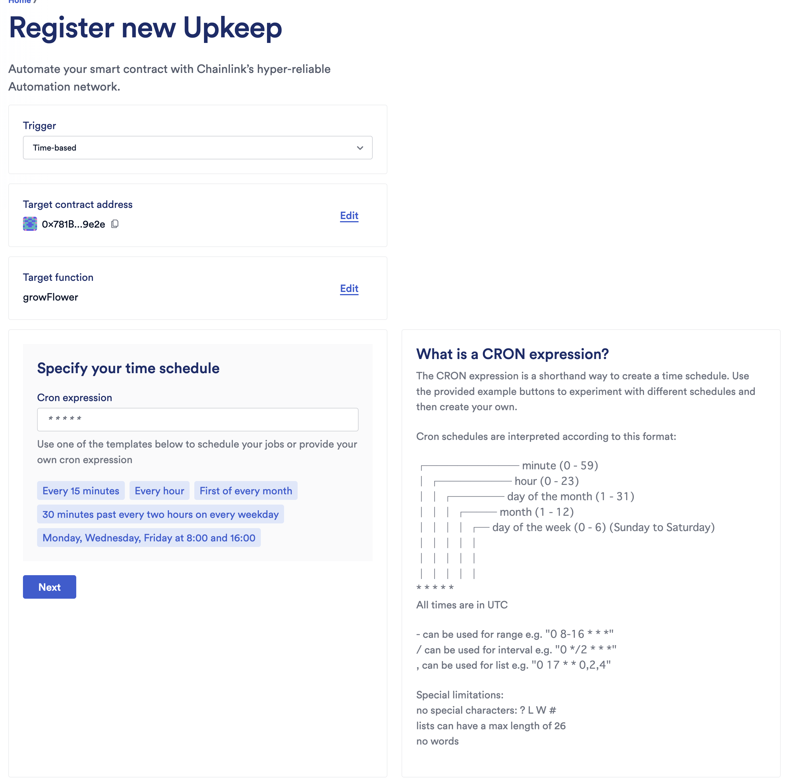
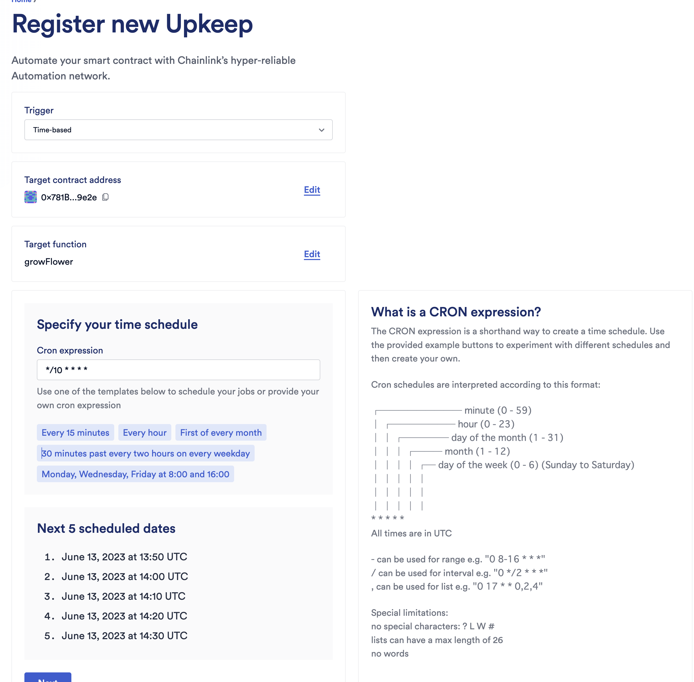
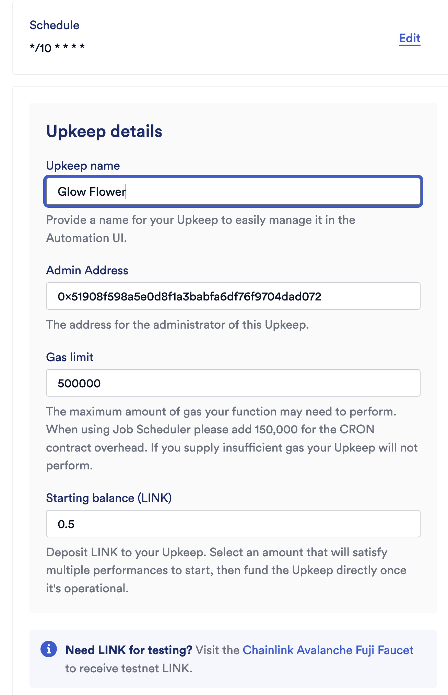
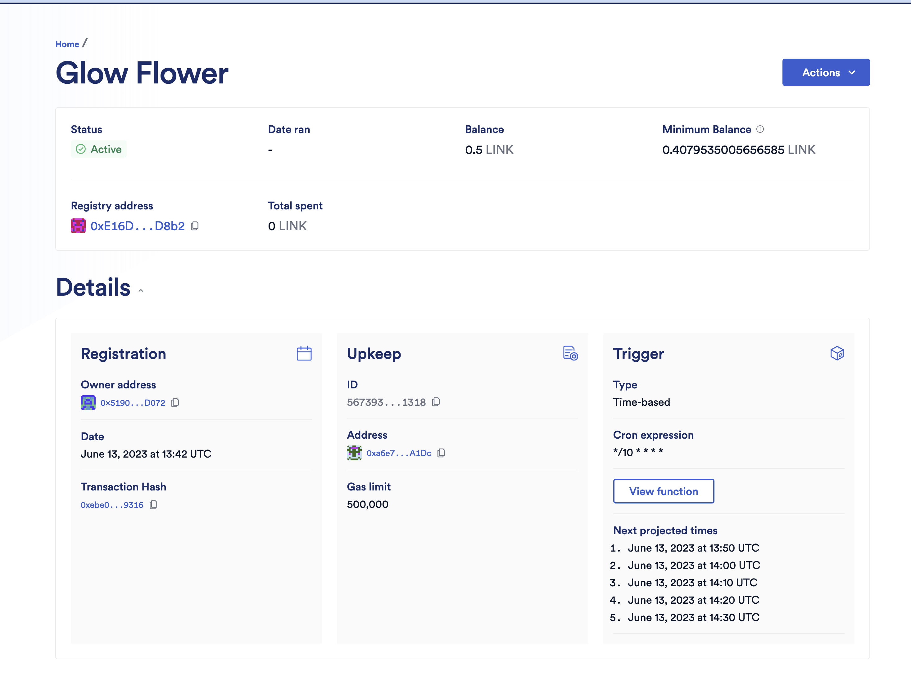
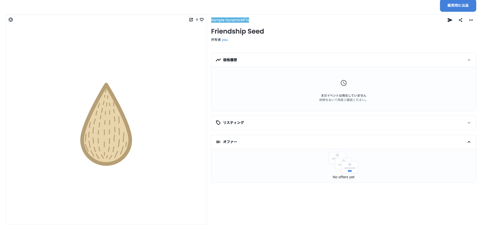
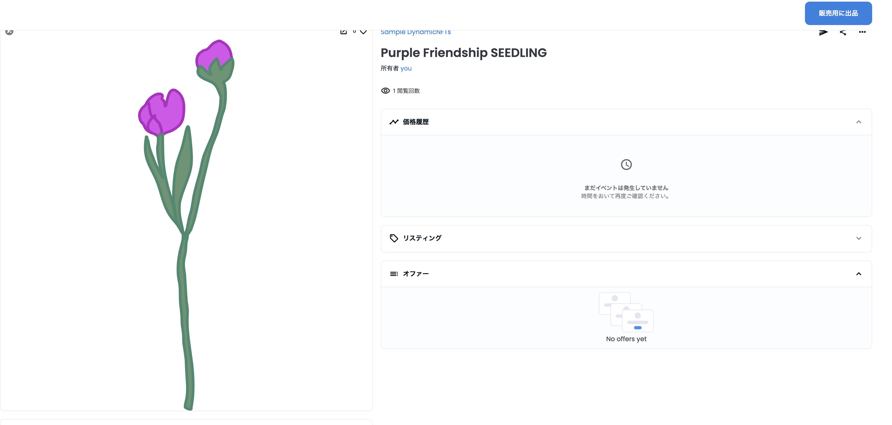

# ChainLink-Sample
ChainLink調査用のリポジトリです。

※ 現在、 Chainlink Functionsの機能は、AllowListで実行できるアカウントが制限されているので申請する必要があります。

手動であれば、Automationの設定はできる模様。

## Automate your Functions のチュートリアル
[https://docs.chain.link/chainlink-functions/tutorials/automate-functions/](https://docs.chain.link/chainlink-functions/tutorials/automate-functions/)

## チュートリアルの日本語訳文

このチュートリアルでは、Chainlink Automationを使用してChainlink Functionsを自動化する方法を説明します。自動化は、毎日天気データを取得したり、ブロックごとに資産価格を取得するなど、同じ機能を定期的に起動させたい場合に不可欠です。

この例のステップに従う前に、APIマルチコールチュートリアルをお読みください。このチュートリアルでは、同じ例を使用しますが、重要な相違点があります：

FunctionsConsumer.solの代わりにAutomatedFunctionsConsumer.solをデプロイすることになります。AutomatedFunctionsConsumer.sol は、Chainlink Automation と互換性のある Chainlink Functions Consumer の契約です。デプロイして契約をセットアップすると、Chainlink Automationはタイムスケジュールに従って機能をトリガーします。

```
注意事項

Chainlink FunctionsはまだBETA版です。  
テスト目的にのみ割り当てられ、機密データや実際の価値を保護しないクレデンシャルをご利用ください。  
リクエストにおけるシークレットの使用は実験的な機能であり、期待通りに動作しない可能性があり、変更される可能性があります。  
この機能の使用はお客様の責任において行われ、予期せぬエラーや、新しいバージョンのリリースに伴いシークレットが明らかになる可能性、またはその他の問題が発生する可能性があります。
```

環境をテストし、すべてが正しく設定されていることを確認するために、リクエストをシミュレートしてください。npx hardhat functions-simulateコマンドを実行します。シミュレーションはローカルのHardhatネットワーク（開発用に設計されたローカルのEthereumネットワークノード）上で実行され、デフォルトのFunctions-request-config.jsファイルに定義されているリクエストを実行します。スターターキットにはトランザクションをシミュレートする機能が含まれているため、DONに送信する前にコードを素早くテストすることができます。

Chainlink Functionsのサブスクリプションを作成し、あなたの契約を承認された消費者契約として追加します。契約書のアドレスを-contractフラグで含めると、1回のトランザクションでこれを行うことができます。この例では、ムンバイのテストネットでは1LINKで十分すぎるほどです。f faucets.chain.linkからいつでもより多くのLINKを取得し、後でそれをサブスクリプションに追加することができます。詳しくは、サブスクリプション管理ページをご覧ください。

## Automate your Functionsの日本語訳

このチュートリアルでは、Chainlink Automationを使用してChainlink Functionsを自動化する方法を説明します。自動化は、毎日天気データを取得したり、ブロックごとに資産価格を取得するなど、同じ機能を定期的に起動させたい場合に不可欠です。

この例のステップに従う前に、APIマルチコールチュートリアルをお読みください。このチュートリアルでは、同じ例を使用しますが、重要な相違点があります：

FunctionsConsumer.solの代わりにAutomatedFunctionsConsumer.solをデプロイすることになります。AutomatedFunctionsConsumer.sol は、Chainlink Automation と互換性のある Chainlink Functions Consumer の契約です。デプロイして契約をセットアップすると、Chainlink Automationはタイムスケジュールに従って機能をトリガーします。

チュートリアル
メモ
環境変数を設定する

このチュートリアルでは、いくつかのユニークな.env.encの設定手順があります。始める前に」セクションで、必要な変数で .env.enc ファイルを構成していることを確認してください。

このチュートリアルは、タイムスケジュールに従って、複数のデータソースからBTC/USD価格の中央値を取得するように設定されています。コード例の詳細な説明については、「説明」セクションをお読みください。

configjsを開きます。argsの値が["1", "bitcoin", "btc-bitcoin"]であることに注目してください。これらの引数は、CoinMarketCap、CoinGecko、CoinpaprikaでのBTC IDです。他の資産価格をフェッチするためにargsを適応させることができます。詳細については、CoinMarketCap、CoinGecko、およびCoinPaprikaのAPIドキュメントを参照してください。リクエストの詳細については、リクエストコンフィグセクションをお読みください。
source.jsを開いて、JavaScriptのソースコードを解析します。リクエストのソースファイルの詳細については、ソースコード解説をお読みください。
シュミレーション
Chainlink Functions Hardhat Starter Kitには、ローカルマシンでFunctionsコードをテストするためのシミュレータが含まれています。functions-simulate コマンドは、ローカルのランタイム環境でコードを実行し、エンドツーエンドのフルフィルメントをシミュレートします。これは、Decentralized Oracle NetworkにFunctionsを提出する前に、問題を修正するのに役立ちます。

functions-simulateタスクを実行して、ローカルでソースコードを実行し、config.jsとsource.jsが正しく記述されていることを確認します：

上記の例の出力を読むと、BTC/USD の中央値が 28347.05 USD であることがわかります。Solidityは小数をサポートしていないため、コールバックでバイトエンコードされた値0x00000000000000002b4111を返す前に、値が整数2834705のように見えるように小数点を移動させます。より詳細な説明は、ソースコードの説明をお読みください。

オートメーションコンシューマーコントラクトのデプロイ
シミュレータを実行し、Functionが問題なく動作することを確認したら、functions-deploy-auto-clientコマンドを実行します。このコマンドは以下のことを行います：

AutomatedFunctionsConsumer.solコントラクトをデプロイします。コントラクトのデプロイ時に、実行間隔を設定することができます。
デプロイされたコントラクトをサブスクリプションに追加します。
デプロイされたコントラクトに格納されているリクエストをシミュレートします。
ソースコード、暗号化されたgist URL、および引数を含むリクエストをコントラクトストレージに保存します。注：保存されたリクエストは、指定された時間間隔に従ってDONに送信されます。

チェーンリンク・オートメーションの設定
デプロイしたコンシューマ契約は、カスタムロジックのアップキープと一緒に使用するように設計されています。アップキープの登録」ガイドの説明に従って、Chainlink Automation Appを使用してデプロイされたコントラクトを登録します。以下のアップキープ設定を使用します：

トリガーを指定します： トリガー：カスタムロジック
対象のコントラクトアドレス： 対象契約アドレス：デプロイしたChainlink Functionsの消費者契約のアドレス
ガスの上限：700000
開始残高（LINK）： 1
このチュートリアルの例では、他の設定はデフォルト値のままでよいでしょう。

Chainlink Automationは、指定した時間間隔に従ってリクエスト送信をトリガーします。

メモ
残高を監視する

監視する必要のある残高が2つあります：

サブスクリプションの残高です： 残高は、Chainlinkファンクションが実行されるたびに請求されます。残高が不足している場合、お客様の契約はリクエストを送信することができません。Chainlinkファンクションを自動化すると、定期的にトリガーされるため、定期的にサブスクリプションアカウントを監視して資金を供給してください。サブスクリプションの残高を確認する方法については、「サブスクリプションの詳細を取得する」を参照してください。
アップキープ残高： この残高は、Chainlink Automation Appで確認することができます。アップキープ残高は、Chainlink Automation Networkに支払い、提供された時間間隔に従ってリクエストを送信します。アップキープ残高が少なくなると、Chainlink Automationはリクエストをトリガーしません。
結果の確認
Chainlink Automation Appにアクセスし、Polygon Mumbaiに接続します。あなたのアップキープが「My upkeeps」に表示されます：

クリーニング
ガイドを終了したら

チェーンリンク自動化アプリからアップキープをキャンセルする。注意：アップキープをキャンセルした後、資金を引き出すことを忘れないでください。アップキープをキャンセルしてから出金できるようになるまで、アップキープ1回で50ブロックの遅延があります。
gistを削除するには、contractパラメータを指定してfunctions-clear-gistsタスクを実行します。

## 手動でAutomain対応のコントラクトにする方法

まず以下2つの変数とメソッドを定義する必要がある。

```js

uint256 lastTimeStamp;
// 実行間隔
uint256 interval;

function checkUpkeep(
    bytes calldata /* checkData */
)
    external
    view
    returns (
        bool upkeepNeeded,
        bytes memory /* performData */
    )
{
    upkeepNeeded = (block.timestamp - lastTimeStamp) > interval;
}

function performUpkeep(
    bytes calldata /* performData */
) external {
    //We highly recommend revalidating the upkeep in the performUpkeep function
    if ((block.timestamp - lastTimeStamp) > interval) {
        lastTimeStamp = block.timestamp;
        // 呼び出したい処理をここに書く
    }
}
```

## 動かし方

```bash
cd functions-hardhat-starter-kit
```

```bash
npm i 
```

```bash
npx hardhat compile
```

```bash
npx hardhat functions-simulate
```

- `FunctionsConsumer`コントラクトのデプロイ

```bash
npx hardhat functions-deploy-client --network polygonMumbai --verify false
```

デプロイ結果

```bash
__Compiling Contracts__
Nothing to compile

Waiting 2 blocks for transaction 0x9d5811dff75efca7ddee2f61c3e0d443f5fb8c5b76c0b7f01ec934f541300a8a to be confirmed...

FunctionsConsumer contract deployed to 0xa9Bf293B85E46079665019BE17a67B8D925572f7 on polygonMumbai
```

- Configure your on-chain resources

```bash
npx hardhat functions-sub-create --network polygonMumbai --amount 5 --contract 0xa9Bf293B85E46079665019BE17a67B8D925572f7
```

実行結果

```bash
Subscription 1816 funded with 5.0 LINK
Adding consumer contract address 0xa9Bf293B85E46079665019BE17a67B8D925572f7 to subscription 1816
Waiting 2 blocks for transaction 0xf7bc5d9c605433e5677d9587a2601edfbccd86db86860ee9d1f55a7754e02b2a to be confirmed...
Authorized consumer contract: 0xa9Bf293B85E46079665019BE17a67B8D925572f7

Created subscription with ID: 1816
Owner: 0x51908F598A5e0d8F1A3bAbFa6DF76F9704daD072
Balance: 5.0 LINK
1 authorized consumer contract:
[ '0xa9Bf293B85E46079665019BE17a67B8D925572f7' ]
```

- サンプル用のスクリプトを実行させる場合

```bash
npx hardhat functions-request --subid 1816 --contract 0xa9Bf293B85E46079665019BE17a67B8D925572f7 --network polygonMumbai
```

実行結果

```bash
__Output from sandboxed source code__
Output represented as a hex string: 0x00000000000000000000000000000000000000000000000000000000000f50ed
Decoded as a uint256: 1003757

ℹ Transaction confirmed, see https://mumbai.polygonscan.com/tx/0x5f56655508a40378d8ab0c9d77e0cb16647f1e6a2164771f8fada8dfeed96404 for more details.
✔ Request 0x4170af9691f041209b01e959b15321b9163f64ee50843b1fa07ff9b1f455f3fc fulfilled! Data has been written on-chain.

Response returned to client contract represented as a hex string: 0x00000000000000000000000000000000000000000000000000000000000f50ed
Decoded as a uint256: 1003757

Actual amount billed to subscription #1816:
┌──────────────────────┬─────────────────────────────┐
│         Type         │           Amount            │
├──────────────────────┼─────────────────────────────┤
│  Transmission cost:  │  0.001529579672068636 LINK  │
│      Base fee:       │          0.2 LINK           │
│                      │                             │
│     Total cost:      │  0.201529579672068636 LINK  │
└──────────────────────┴─────────────────────────────┘
```


- 自動で実行させるようにしたい場合

```bash
npx hardhat functions-deploy-auto-client --network polygonMumbai --subid 1816 --interval 60 --configpath Functions-request-config.js
```

実行結果


```bash
Added consumer contract address 0x4747b535f1C4a48bbfc88CA68DC8973DD38Eb413 to subscription 1816
4 authorized consumer contracts for subscription 1816:
[
  '0xa9Bf293B85E46079665019BE17a67B8D925572f7',
  '0xa711098909503e0A6087c43150BE944c61016924',
  '0x8760411d317e560021dB83b35971AB0dDEd4E205',
  '0x4747b535f1C4a48bbfc88CA68DC8973DD38Eb413'
]
Setting the Functions request in AutomatedFunctionsConsumer contract 0x4747b535f1C4a48bbfc88CA68DC8973DD38Eb413 on polygonMumbai
Simulating Functions request locally...

__Console log messages from sandboxed code__
Bad API request failed. (This message is expected to demonstrate using console.log for debugging locally with the simulator)
Median Bitcoin price: $26032.17

__Output from sandboxed source code__
Output represented as a hex string: 0x000000000000000000000000000000000000000000000000000000000027b8d1
Decoded as a uint256: 2603217

Successfully created encrypted secrets Gist: https://gist.github.com/mashharuki/388f070c5b426093783df82c3d598bfa
Be sure to delete the Gist https://gist.github.com/mashharuki/388f070c5b426093783df82c3d598bfa once encrypted secrets are no longer in use!

Setting Functions request

Waiting 2 block for transaction 0x7905d0f68f2278fc669234a89b1dcc02970dcc410646305cdff2d4dc72c9b3fe to be confirmed...

Created new Functions request in AutomatedFunctionsConsumer contract 0x4747b535f1C4a48bbfc88CA68DC8973DD38Eb413 on polygonMumbai

AutomatedFunctionsConsumer contract deployed to 0x4747b535f1C4a48bbfc88CA68DC8973DD38Eb413 on polygonMumbai
```

- ローカルでのシミュレーション

```bash
npx hardhat functions-simulate --configpath Functions-request-config.js
```

実行結果

```bash
secp256k1 unavailable, reverting to browser version

__Compiling Contracts__
Nothing to compile
Duplicate definition of Transfer (Transfer(address,address,uint256,bytes), Transfer(address,address,uint256))

Executing JavaScript request source code locally...

__Console log messages from sandboxed code__
Bad API request failed. (This message is expected to demonstrate using console.log for debugging locally with the simulator)
Median Bitcoin price: $26029.31

__Output from sandboxed source code__
Output represented as a hex string: 0x000000000000000000000000000000000000000000000000000000000027b7b3
Decoded as a uint256: 2602931

__Simulated On-Chain Response__
Response returned to client contract represented as a hex string: 0x000000000000000000000000000000000000000000000000000000000027b7b3
Decoded as a uint256: 2602931

Gas used by sendRequest: 439384
Gas used by client callback function: 75029
```

スクリプトを呼び出す方法  
※ 事前にChainlink Automain Appで登録している必要あり！！

```bash
npx hardhat functions-read  --contract 0x4747b535f1C4a48bbfc88CA68DC8973DD38Eb413 --network polygonMumbai --configpath Functions-request-config.js
```

実行結果

```bash
lygonMumbai --configpath Functions-request-config.js
secp256k1 unavailable, reverting to browser version
Reading data from Functions client contract 0x4747b535f1C4a48bbfc88CA68DC8973DD38Eb413 on network polygonMumbai

On-chain response represented as a hex string: 0x000000000000000000000000000000000000000000000000000000000027af6f
Decoded as a uint256: 2600815
```

## Dynamic NFTの動かし方

```bash
npm i
```

```bash
npm run deploy:fuji
```

- 実行結果

```bash
Compiled 1 Solidity file successfully
deployed to 0x781BBC6B014c9f5055ad23f3CD5Fc5aa27039e2e
```

残りは、Automation UpKeepの方で設定する。









以下は、実際に指定した例

[56739379989183854243409540443502035021085634288274005226243520506999006251318](https://automation.chain.link/fuji/56739379989183854243409540443502035021085634288274005226243520506999006251318)

- OpenSeaでは下記の通り

[Sample DynamicNFTs](https://testnets.opensea.io/ja/assets/avalanche-fuji/0x781bbc6b014c9f5055ad23f3cd5fc5aa27039e2e/0)

成長していることがわかる。





## 参考文献
1. [スターターキット](https://github.com/smartcontractkit/functions-hardhat-starter-kit)
2. [Chainlink Functionsメモ](https://zenn.dev/pokena/scraps/a3aaff73a7c21d)
3. [How To Use Chainlink Functions | Chainlink Engineering Tutorials](https://www.youtube.com/watch?v=nKRZ1R2BC4Q)
4. [Automain Chainlink App](https://automation.chain.link/)
5. [実際にAutomainとして登録したスマートコントラクトの例](https://automation.chain.link/fuji/52432413965313473664485316098653309434272671953320176872330438941768262658891)
6. [Register a Custom Logic Upkeep](https://docs.chain.link/chainlink-automation/register-upkeep/#register-an-upkeep-using-the-chainlink-automation-app)
7. [【REMIX】サンプル用のAutomain用のスマコン](https://remix.ethereum.org/#url=https://docs.chain.link/samples/Automation/tutorials/EthBalanceMonitor.sol&lang=en&optimize=false&runs=200&evmVersion=null&version=soljson-v0.8.18+commit.87f61d96.js)
8. [How To Create Dynamic NFTs Using Chainlink Automation | Chainlink Engineering Tutorials](https://www.youtube.com/watch?v=E7Rm1LUKhj4)
9. [実際にデプロイしたAutomainスクリプトコントラクト](https://automation.chain.link/mumbai/18268368912146003678957606947898212473059057081127208716115380477784269230939)